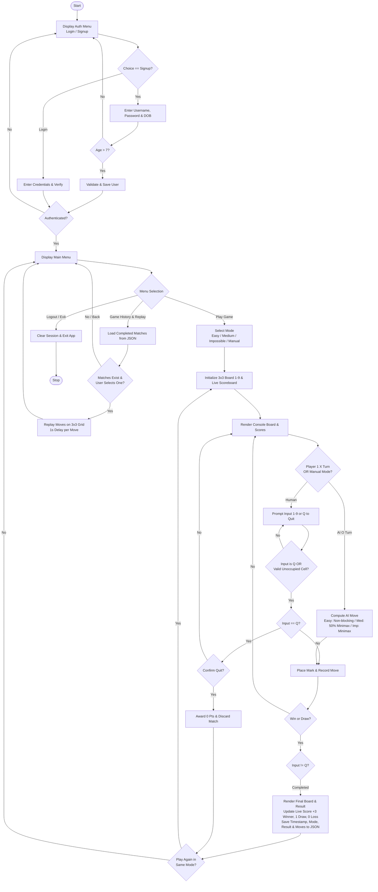

# System Architecture 
 

```mermaid
flowchart TD
    Start([Start]) --> AuthMenu[Display Auth Menu<br/>Login / Signup]
    AuthMenu --> Choice{Choice == Signup?}
    
    Choice -- Yes --> Signup[Enter Username, Password & DOB]
    Signup --> AgeCheck{Age > 7?}
    AgeCheck -- No --> AuthMenu
    AgeCheck -- Yes --> SaveUser[Validate & Save User]
    Choice -- Login --> Login[Enter Credentials & Verify]
    
    SaveUser --> AuthCheck{Authenticated?}
    Login --> AuthCheck
    AuthCheck -- No --> AuthMenu
    
    AuthCheck -- Yes --> MainMenu[Display Main Menu]
    MainMenu --> MenuSel{Menu Selection}
    
    %% Case 1: Play Game
    MenuSel -- Play Game --> SelMode[Select Mode<br/>Easy / Medium / Impossible / Manual]
    SelMode --> InitBoard[Initialize 3x3 Board 1-9 & Live Scoreboard]
    InitBoard --> RenderBoard[Render Console Board & Scores]
    RenderBoard --> TurnCheck{Player 1 X Turn<br/>OR Manual Mode?}
    
    TurnCheck -- Human --> Prompt[Prompt Input 1-9 or Q to Quit]
    Prompt --> ValidInput{Input is Q OR<br/>Valid Unoccupied Cell?}
    ValidInput -- No --> Prompt
    ValidInput -- Yes --> QuitCheck{Input == Q?}
    
    QuitCheck -- Yes --> ConfirmQuit{Confirm Quit?}
    ConfirmQuit -- No --> RenderBoard
    ConfirmQuit -- Yes --> Discard[Award 0 Pts & Discard Match]
    QuitCheck -- No --> PlaceMark[Place Mark & Record Move]
    
    TurnCheck -- AI O Turn --> AIMove[Compute AI Move<br/>Easy: Non-blocking / Med: 50% Minimax / Imp: Minimax]
    AIMove --> PlaceMark
    
    PlaceMark --> WinDraw{Win or Draw?}
    WinDraw -- No --> RenderBoard
    WinDraw -- Yes --> CompletedCheck{Input != Q?}
    
    CompletedCheck -- Completed --> EndGame[Render Final Board & Result<br/>Update Live Score +3 Winner, 1 Draw, 0 Loss<br/>Save Timestamp, Mode, Result & Moves to JSON]
    EndGame --> PlayAgain{Play Again in<br/>Same Mode?}
    Discard --> PlayAgain
    
    PlayAgain -- Yes --> InitBoard
    PlayAgain -- No --> MainMenu
    
    %% Case 2: Game History & Replay
    MenuSel -- Game History & Replay --> LoadHistory[Load Completed Matches from JSON]
    LoadHistory --> HistoryCheck{Matches Exist &<br/>User Selects One?}
    HistoryCheck -- Yes --> Replay[Replay Moves on 3x3 Grid<br/>1s Delay per Move]
    HistoryCheck -- No / Back --> MainMenu
    Replay --> MainMenu
    
    %% Case 3: Logout / Exit
    MenuSel -- Logout / Exit --> ExitApp[Clear Session & Exit App]
    ExitApp --> Stop([Stop])

```

